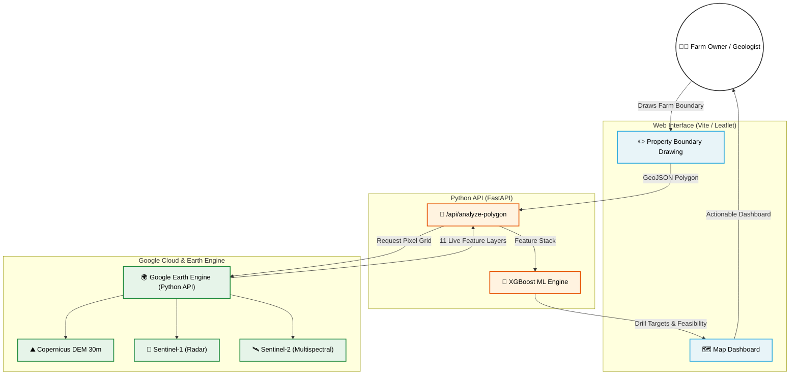

# Landsat Water Intelligence Platform
[]()
[]()
[]()
[]()
[]()

A commercial-grade geographic intelligence platform designed for hydrogeologists and farm owners in arid terrains (like the Kalahari and Okavango). It leverages real-time Google Earth Engine telemetry, Sentinel/Landsat satellite imagery, and an XGBoost machine learning model to predict high-yield borehole targets and evaluate subsurface water feasibility.

---

## 🚀 Live Application Architecture



| Component | Technology |
|---|---|
| **Frontend App** | Vite, Vanilla JS, Leaflet.js |
| **Map Tiles** | Microsoft Planetary Computer, Esri |
| **Backend API** | Python 3, FastAPI, Uvicorn |
| **Cloud Telemetry** | Google Earth Engine Python API |
| **Machine Learning** | XGBoost, Scikit-Learn |
| **Authentication** | GCP Service Accounts (.json keys) |
| **Styling** | Custom CSS (Field-Survey Palette) |

---

## 🛠️ Key Features
- **Interactive Farm Drawing:** Draw dynamic polygon boundaries directly on the map to bound the investigation.
- **Live Earth Engine Telemetry:** The Python backend queries Google Earth Engine dynamically, extracting Live Topography (Slope, TWI), Structure (SAR VV/VH), and Vegetation indices (NDWI, NDVI).
- **XGBoost Subsurface Predictions:** Processes satellite data instantly through an XGBoost model trained on historical BGI borehole data to score locations on Water Table Depth, Yield, and Borehole Feasibility.
- **Automated Dossier Generation:** Prepares printable, professional hydrogeological reports instantly based on the drawn property boundaries.

---

## 💻 Local Installation & Usage

### Prerequisites
1. Node.js (v18+)
2. Python (3.9+)
3. A Google Cloud Service Account JSON Key with Earth Engine Access

### 1. Setup the Frontend
```bash
npm install
npm run dev
```
*The frontend will launch on `http://localhost:5173`.*

### 2. Setup the Backend API
Install backend dependencies:
```bash
pip install fastapi uvicorn earthengine-api xgboost pandas
```

Place your Google Cloud Service Account JSON key inside `.gee_secrets/service_account.json` (you will need to create this directory).

Start the FastAPI server:
```bash
python -m uvicorn backend.main:app --reload
```
*The API will listen on `http://127.0.0.1:8000`.*

---

## 📜 License
Proprietary / Closed Source. Developed for Landsat Water Intelligence operations.
